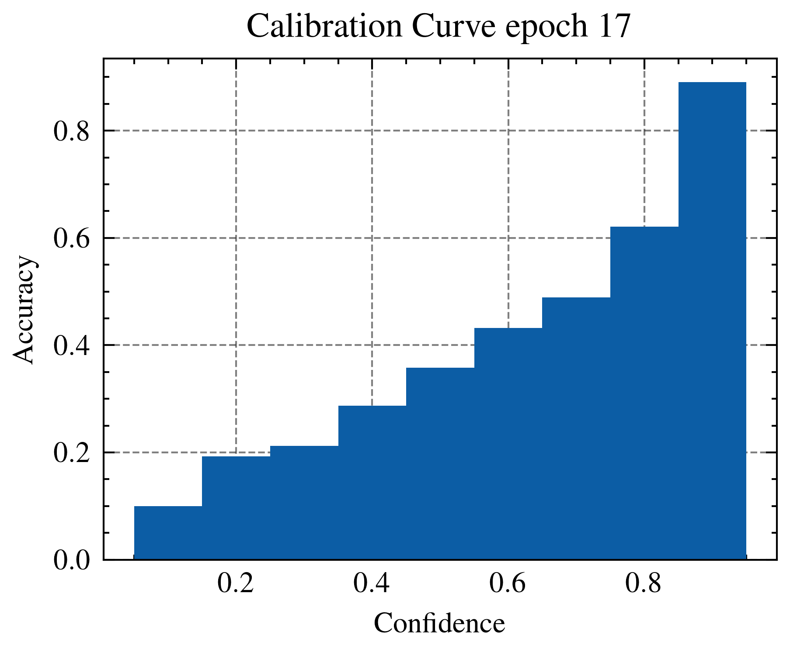
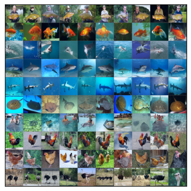

# Visualization

## Top 100 images flagged by different SOTA methods. Note that they fail to capture the failure mode of duplicate images with conflicting labels.

Use ctrl + scroll (or use pinch to zoom on mobile) to zoom into images.

### Top CIFAR100 images detected by SSFT as easy to forget

Figure 1: Top CIFAR100 images detected by SSFT as easy to forget

### Top CIFAR100 images detected by SimiFeat as likely noisy

Figure 2: Top CIFAR100 images detected by SimiFeat as likely noisy

### High curvature samples from training set according to Slo-Curves (Garg & Roy, 2023)

Figure 3: High curvature samples from training set according to Slo-Curves (Garg & Roy, 2023). Obtained from ResNet18 trained without weight decay on CIFAR100

## Calibration curves: Early stopping using curvature of training set as a criterion yields better-calibrated networks.

### Model calibration at lowest validation loss stopping (Epoch 17)

Figure 4: Model calibration at lowest validation loss stopping (Epoch 17).

### Model calibration at highest curvature stopping (Epoch 19)

Figure 5: Model calibration at highest curvature stopping (Epoch 19).

### Model calibration at end of training (overconfident model)

Figure 6: Model calibration at end of training (overconfident model).

## Landscape Visualization
Visualizing the loss landscape and decision boundary during training on a toy dataset.

## Higher Quality Images
### ImageNet, High Curvature Images

### ImageNet, Low Curvature Images

## Higher Quality Version of Most Memorized according to FZ scores on CIFAR100

## Higher Quality Version of Highest Curvature with Weight Decay on CIFAR100
